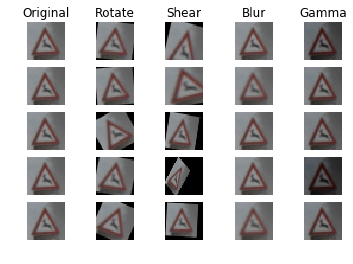
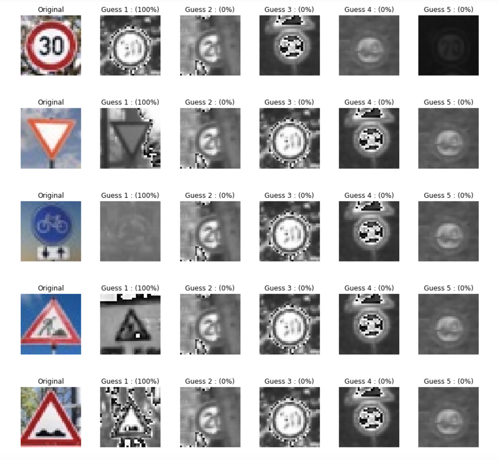

# Traffic Sign Classifier

## Writeup by Matthew Jones

### Project: CarND-Traffic-Sign-Classifier-P3
---

**Build a Traffic Sign Classifer**

The main steps for this project are the following:
* Load the data set (see below for links to the project data set)
* Explore, summarize and visualize the data set
* Design, train and test a model architecture
* Use the model to make predictions on new images
* Analyze the softmax probabilities of the new images
* Summarize the results with a written report

## Rubric Points
### Here I will consider the [rubric points](https://review.udacity.com/#!/rubrics/481/view) individually and describe how I addressed each point in my implementation.  

---
### Writeup / README

Here is a link to my [project code](https://github.com/matttpj/CarND-Traffic-Sign-Classifier)  

### Data Set Summary & Exploration

#### 1. Provide a basic summary of the data set. In the code, the analysis should be done using python, numpy and/or pandas methods rather than hardcoding results manually.

I used the numpy library to calculate summary statistics of the traffic signs data set:

* The size of training set is __34,799__
* The size of the validation set is __4,410__
* The size of test set is __12,630__
* The shape of a traffic sign image is __(32, 32, 3)__
* The number of unique classes/labels in the data set is __43__

#### 2. Include an exploratory visualization of the dataset.

See below for an exploratory visualization of the training data set, including a random selection of 20 images and a histogram showing the frequency distribution of images by traffic sign type (class id).  
 
__Sample images (Training Set)__  
  
__Histogram of images by ClassId__  
  
 

### Design and Test a Model Architecture

#### 1. Describe how you preprocessed the image data. What techniques were chosen and why did you choose these techniques? Consider including images showing the output of each preprocessing technique. Pre-processing refers to techniques such as converting to grayscale, normalization, etc. (OPTIONAL: As described in the "Stand Out Suggestions" part of the rubric, if you generated additional data for training, describe why you decided to generate additional data, how you generated the data, and provide example images of the additional data. Then describe the characteristics of the augmented training set like number of images in the set, number of images for each class, etc.)

Below steps were inspired by the Udacity programme materials and from reading the whitepaper on [Traffic Sign Recognition with Multi-Scale Convolutional Networks](http://yann.lecun.com/exdb/publis/pdf/sermanet-ijcnn-11.pdf) by Pierre Sermanet and Yann LeCun.

The following pre-processing steps were performed on the training data **_(../data/train.p)._**
  * __Augment the number of images by a scale factor__  
 _Many of the image classes had less than ~250 samples which was insufficient to train the model without giving undue bias to the image classes with greater than ~1250 samples. Hence I augmented the data with increased emphasis on scaling the numbers of those images with fewer samples by creating additional samples with random variants of shear, blur and gamma transformations. This was done with the following steps:_
  * __Separate the traffic signs into separate arrays__
  * __Calculate the no. of signs per traffic sign class__
  * __Calculate the mean no. of signs per class__
  * __Calculate the mean per sign class / images per sign class__  
  _This will show for each image class the factor by how much it is greater or lesser compared to the average_  
  * __Select an initial Scale Factor multiplier to boost the signs with fewer samples over ~ 2,000 sample threshold to reduce the model bias__  
  * __Generate additional images per class as determined by final Scale Factor__    
  _Final Scale Factor = (Initial Scale Factor * avg_per_sign / images_per_sign)_    
 _Initial Scale Factor was modified by trial and error to find a value that improved ConvNet accuracy_  

The above augmentation method was derived from what is described here _https://github.com/eqbal/CarND-Traffic-Sign-Classifier-Project_

Prior to running the model, additional steps were performed:
* __Convert images to grayscale__  
_The above referenced Sermanet and LeCun whitepaper mentions on page 2 that using grayscale images improved ConvNet performance_
* __Normalize the data__  
_As recommended by Udacity programme, image data was Normalized to the range (-1, +1) by applying following calculation to X_train pixel data >>> **(X_train - 128) / 128**._  

The difference between the original data set and the augmented data set is illustrated by the below charts.
 
* __Training data set: pre v. post image pre-processing and augmentation__

 

Here are some example of augmented images created off the original image X_train[555], Class Id: 12 >> Priority road:  
* __Augmented image examples__

 

#### 2. Describe what your final model architecture looks like including model type, layers, layer sizes, connectivity, etc.) Consider including a diagram and/or table describing the final model.

* __LeNet training model__

 

Taking above LeNet model, as a starting point my final model consisted of the following layers:
_[minimally changed from the starter code provided]_

| Layer         		|     Description	        					|
|:---------------------:|:---------------------------------------------:|
| Input         		| 32x32x3 RGB image   							|
| Layer 1: Convolution 3x3     	| 1x1 stride, same padding, outputs 28x28x6 	|
| RELU					|												|
| Max pooling	      	| Input = 28x28x6 2x2 stride,  outputs 14x14x6				|
| Layer 2: Convolution 3x3     	| 1x1 stride, same padding, outputs 10x10x6 	|
| RELU					|												|
| Max pooling	      	| Input = 14x14x6 2x2 stride,  outputs 10x10x16				|
| Flatten		| Input = 10x10x6. Output = 5x5x16 									|
| Layer 3: Convolution 3x3     	| Input = 400, Output = 120 	|
| RELU					|												|
| Layer 4: Convolution 3x3     	| Input = 120, Output = 84 	|
| RELU					|												|
| Layer 5: Convolution 3x3     	| Input = 84, Output = 43 	|
| RELU					|												|
| Softmax				| etc.        									|
|						|												|
|						|												|

#### 3. Describe how you trained your model. The discussion can include the type of optimizer, the batch size, number of epochs and any hyperparameters such as learning rate.

To train the model, I tried adjusting each of the following variables up and down in turn. Then I settled with below values to maximise Validation Accuracy results.  
__TensorFlow__  
* EPOCHS = 14  
* BATCH_SIZE = 100     
__LeNet__  
* mu = 0  
* sigma = 0.1  
__Training Pipeline__  
* rate = 0.0009    
__Image Pre-Processing__  
* SCALE_FACTOR = 2.8  [initial]  

#### 4. Describe the approach taken for finding a solution and getting the validation set accuracy to be at least 0.93. Include in the discussion the results on the training, validation and test sets and where in the code these were calculated. Your approach may have been an iterative process, in which case, outline the steps you took to get to the final solution and why you chose those steps. Perhaps your solution involved an already well known implementation or architecture. In this case, discuss why you think the architecture is suitable for the current problem.

My final model results were:
* training set accuracy of **0.899**  
* validation set accuracy of **0.938**  
* test set accuracy of **0.993**    

If an iterative approach was chosen:
* What was the first architecture that was tried and why was it chosen? **The architecture was kept pretty much the same as provided by the Udacity programme**
* What were some problems with the initial architecture? **It seemed to work okay**
* How was the architecture adjusted and why was it adjusted? Typical adjustments could include choosing a different model architecture, adding or taking away layers (pooling, dropout, convolution, etc), using an activation function or changing the activation function. One common justification for adjusting an architecture would be due to overfitting or underfitting. A high accuracy on the training set but low accuracy on the validation set indicates over fitting; a low accuracy on both sets indicates under fitting.
* Which parameters were tuned? How were they adjusted and why?
Through trial and error, I adjusted the following parameters:
__EPOCHS__ >> _Accuracy improved after ~ 8 epochs but by 12 epochs any improvement was minimal_
__mu__ >> _Accuracy decreased if mu was made too large or too small_
__sigma__ >> _Accuracy decreased if sigma was made too large or too small_
__rate__ >> _Accuracy decreased if the training rate was made too large or too small_
__SCALE_FACTOR [initial]__  >> _This needed to be kept < 2.8 so that the pickle file did not exceed 3GB limit in the Udacity workspace. However, for my final few rounds I stopped loading from the pickle file._
* What are some of the important design choices and why were they chosen? For example, why might a convolution layer work well with this problem? How might a dropout layer help with creating a successful model? _Convolution layer works well for traffic sign classifying as we apply multiple filters over the image to extract different features and then the model learns those filters!_  _A dropout layer can be useful in a CNN to prevent the model from overfitting. Although when I experimented with one in my model, I was unable to get it to improve the model accuracy_

If a well known architecture was chosen:
* What architecture was chosen?  **LeNet** _[but modified as per Udacity programme recommendation]_
* Why did you believe it would be relevant to the traffic sign application?  _LeNet is a proven re-usable architecture for achieving high level of accuracy for 2D image recognition and the German traffic sign database holds a large number of well-defined traffic sign photos for which the variation for each sign is minimal; the only things that are changing are things like viewing angle, light conditions etc..._
* How does the final model's accuracy on the training, validation and test set provide evidence that the model is working well? **The model has an increasing level of accuracy on smaller data sets (training >> validation >> test) and even on the augmented training data set with >140,000 images accuracy is still ~90%**

### Test a Model on New Images

#### 1. Choose five German traffic signs found on the web and provide them in the report. For each image, discuss what quality or qualities might be difficult to classify.

Here are five German traffic signs that I used Google Search to find on the internet and which I then downloaded and trimmed to 32x32 pixels. These images are available at **_./test_images/*.jpg_**

 

 

Each of the images looked very clear and straightforward to classify.

#### 2. Discuss the model's predictions on these new traffic signs and compare the results to predicting on the test set. At a minimum, discuss what the predictions were, the accuracy on these new predictions, and compare the accuracy to the accuracy on the test set (OPTIONAL: Discuss the results in more detail as described in the "Stand Out Suggestions" part of the rubric).

Here are the results of my model's prediction on the images downloaded from the web:

| #       |    Image			        |     Prediction	        					|
|:-------:|:---------------------:|:---------------------------------:|
| 01.jpg  | 30 km/h      		  | 100%  									|
| 02.jpg  | Yield     			  | 100%										|
| 03.jpg  | Bike crossing		  | 67%											|
| 04.jpg  | Roadworks	      	| 75%				 				|
| 05.jpg  | Bumpy road			  | 60%     							|

**still to do**

#### 3. Describe how certain the model is when predicting on each of the five new images by looking at the softmax probabilities for each prediction. Provide the top 5 softmax probabilities for each image along with the sign type of each probability. (OPTIONAL: as described in the "Stand Out Suggestions" part of the rubric, visualizations can also be provided such as bar charts)

The code for making predictions on my final model is located in one of the bottom cells of the Ipython notebook.

My model predicts that it will be able to guess 4 of the 5 traffic signs, which gives an accuracy of 80%. This compares a little less than favourable to the accuracy of the test set of images. However, 03.jpg should be discounted as the Training data set only contains Bicycle warning signs inside a red triangle (class id 29).  Hence, this would make for overall accuracy of 100% (4 of 4), with only 05.jpg of the Bumpy road incorrectly classified.

For the first image 01.jpg, the model is very sure that this is a 30km/h sign (probability of 100%), and the image does contain a 30km/h sign. The top five softmax probabilities were:

| Rank     | Probability         	|     Prediction	        					|
|:-----:|:---------------------:|:---------------------------------:|
|  1.   | 1.00         			| 30 km/h   									|
|  2.   | 0     				| 20 km/h  										|
|  3.   | 0					| 50 km/h 										|
|  4.   | 0	      			| 50 km/h 					 				|
|  5.   | 0				    | 100 km/h      							|

For the second image 02.jpg, the model is very sure that this is a Yield sign (probability of 100%), and the image does contain a Yield sign. The top five softmax probabilities were:

| Rank     | Probability         	|     Prediction	        					|
|:-----:|:---------------------:|:---------------------------------:|
|  1.   | 1.00         			| Yield   									|
|  2.   | 0     				| Bumpy road  										|
|  3.   | 0					| Priority 										|
|  4.   | 0	      			| Tractor					 				|
|  5.   | 0				    | Children crossing      							|

For the third image 03.jpg, the model is very sure that this is a Roundabout sign (probability of 100%), but the image is a Bicycles sign.  From looking again at the GTSRB images, Bicycles crossing sign is inside a red triangle.  Hence it is no surprise that the model does not recognise this sign. The top five softmax probabilities were:

| Rank     | Probability         	|     Prediction	        					|
|:-----:|:---------------------:|:---------------------------------:|
|  1.   | 1.00         			| Roundabout   									|
|  2.   | 0     				| Priority 										|
|  3.   | 0					| Keep right 										|
|  4.   | 0	      			| Left turn 					 				|
|  5.   | 0				    | Priority at next junction     							|

For the fourth image 04.jpg, the model is very sure that this is a Roadworks sign (probability of 100%), and the image does contain a Roadworks sign. The top five softmax probabilities were:

| Rank     | Probability         	|     Prediction	        					|
|:-----:|:---------------------:|:---------------------------------:|
|  1.   | 1.00         			| Roadworks   									|
|  2.   | 0     				| Children crossing 										|
|  3.   | 0					| Bumpy road 										|
|  4.   | 0	      			| Right bend 					 				|
|  5.   | 0				    | Beware of ice/snow      							|

For the fifth image 05.jpg, the model is very sure that this is a Yield sign (probability of 100%), but the image is in fact a Bumpy road sign. The top five softmax probabilities were:

| Rank     | Probability         	|     Prediction	        					|
|:-----:|:---------------------:|:---------------------------------:|
|  1.   | 1.00         			| Yield  									|
|  2.   | 0     				| Tractor  										|
|  3.   | 0					| Bumpy road 										|
|  4.   | 0	      			| Road narrows					 				|
|  5.   | 0				    | Children crossing       							|
 

 

### (Optional) Visualizing the Neural Network (See Step 4 of the Ipython notebook for more details)
#### 1. Discuss the visual output of your trained network's feature maps. What characteristics did the neural network use to make classifications?

**_Not attempted_**
